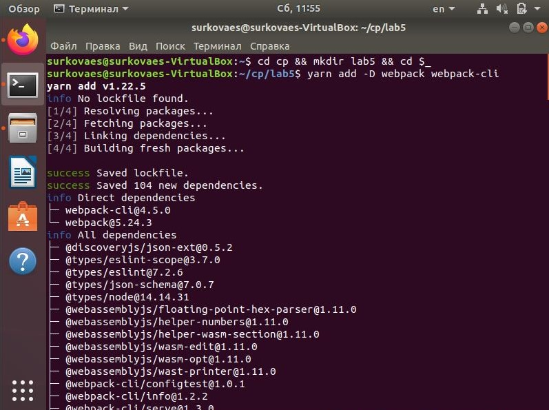
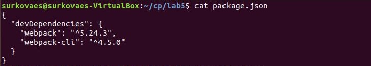
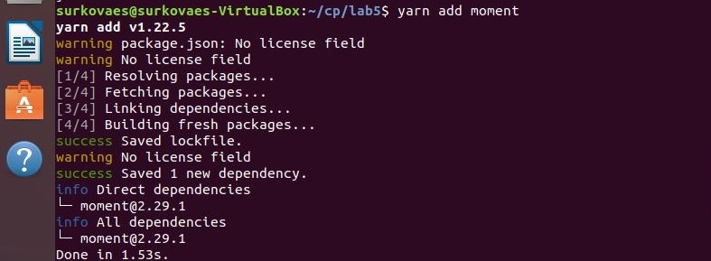
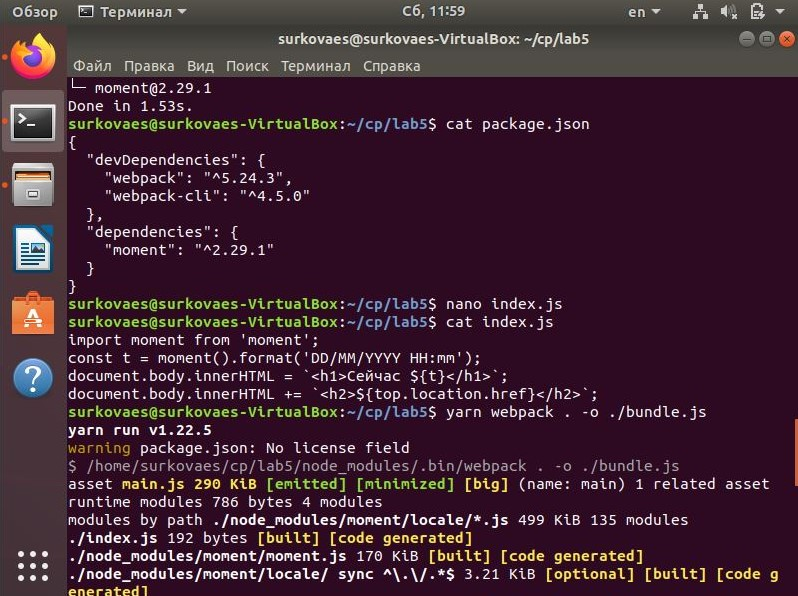
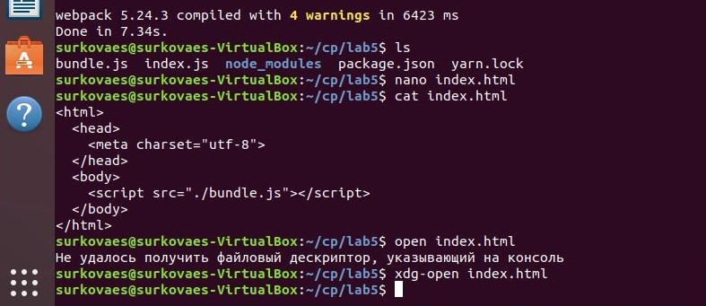
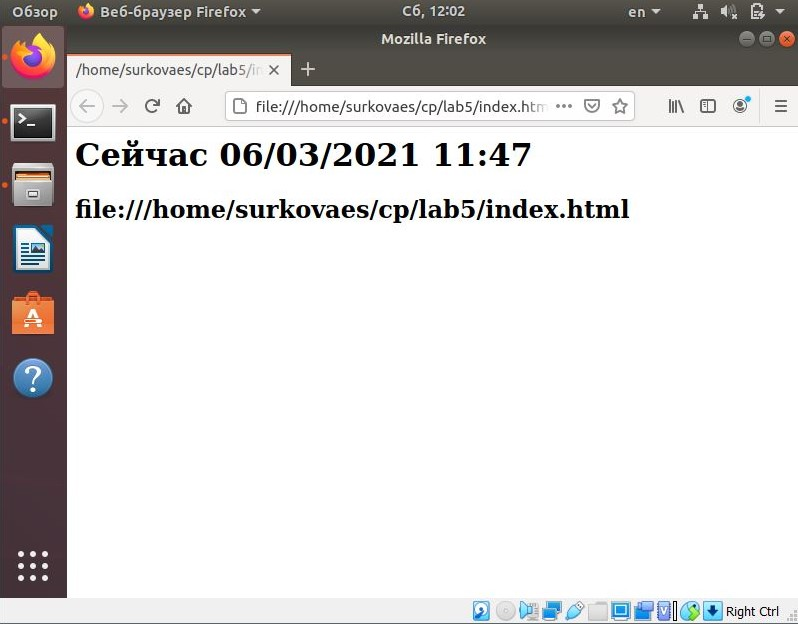

# Лабораторная работа 5
## Модульность в экосистеме Javascript
### Сборка проекта для публикации (webpack)

Создание папки для проекта и установка зависимостей webpack и webpack-cli

Содержимое файла package.json

Добавление зависимости moment

Содержимое файла package.json, создание файла index.js

Создание файла index.html, сборка проекта

Результат

