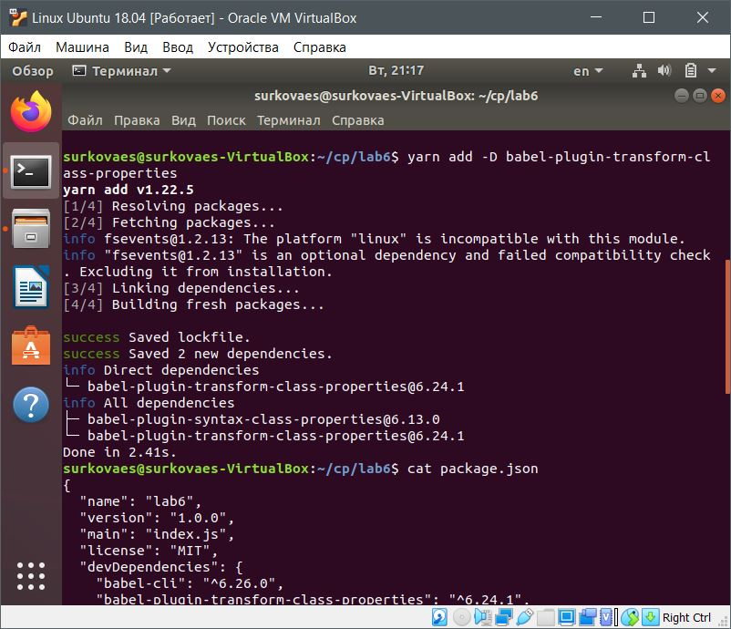
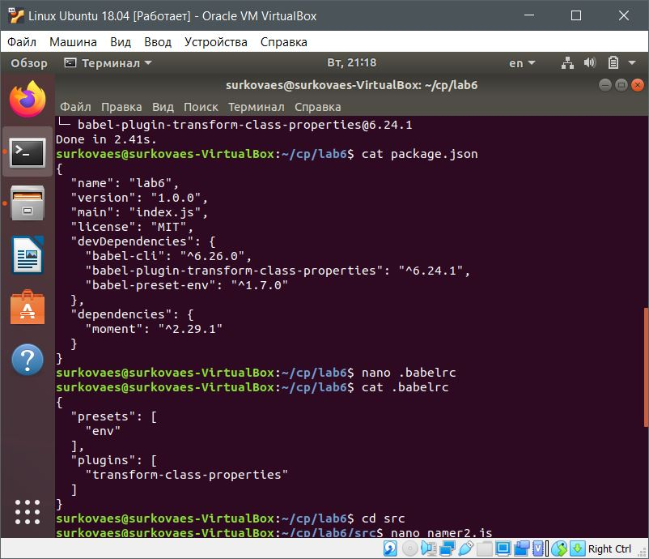
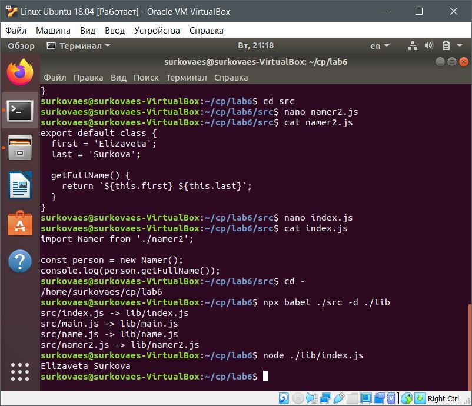

# Лабораторная работа 6
## Тема 1. Структура экосистемы веб-языков и технологий
### II. Преобразование кода на JavaScript, содержащего конструкции из следующих версий стандарта ECMAScript

Добавление поддержки class properties

Изменение файла .babelrc

Создание варианта экспортируемого класса без конструктора: namer2.js
Осуществление его импорта в файле index.js
Получение оттранспилированных файлов с помощью команды `npx babel ./src -d ./lib`

